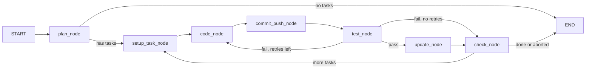

# Architecture

## System Overview

A modular, local-first AI agent system powered by Ollama. Designed for zero-cost
operation with a clear upgrade path to multi-agent workflows.

## Folder Structure

```
CodeAgents-Open/
├── agents/
│   ├── base.py             # BaseAgent ABC (tool binding, LLM injection)
│   ├── sprint_planner.py   # Sprint planning agent (plan + execute)
│   ├── coder.py            # CoderAgent — wraps Aider CLI for code generation
│   ├── tester.py           # TesterAgent — runs pytest, reports pass/fail
│   └── updater.py          # UpdaterAgent — creates PRs, updates Notion status
├── tools/
│   ├── notion_tool.py      # Notion read-only sync (properties + page content)
│   ├── notion_write_tool.py # Local write-back (pending changes pattern)
│   ├── notion_renderer.py  # Block-to-markdown converter (30+ block types)
│   ├── git_tool.py         # BaseGitTool ABC (shared CLI execution)
│   ├── github_tool.py      # GitHub provider (gh CLI)
│   ├── azdevops_tool.py    # Azure DevOps provider (az repos CLI)
│   └── aider_tool.py       # Aider CLI wrapper for AI-assisted code edits
├── schemas/
│   ├── notion_models.py    # Notion entity models (5 entities + sync metadata)
│   ├── git_models.py       # Git models (Branch, PullRequest, CommitInfo)
│   ├── agent_models.py     # AgentResult structured output schema
│   ├── aider_models.py     # Aider invocation/result models
│   └── sprint_state.py     # SprintState TypedDict for LangGraph cascade
├── config/
│   └── settings.py         # Pydantic settings, LLM factory, registries
├── data/
│   ├── notion/
│   │   ├── *.json           # Cloud snapshots (never modified)
│   │   ├── content/*.md     # Page content as markdown
│   │   ├── templates/       # Database templates
│   │   ├── pending_changes.json  # Local mutation changelog
│   │   └── local_snapshot.json   # Merged local state
│   ├── cascade/            # Saved cascade run states (JSON)
│   └── chroma/            # ChromaDB persistent vector storage (gitignored)
├── rag/
│   ├── ingest.py          # Notion content → ChromaDB ingestion
│   ├── retriever.py       # Semantic search query interface
│   └── snapshot_lookup.py # Relational snapshot index for composed queries
├── orchestration/
│   ├── cascade.py          # LangGraph StateGraph (plan→code→test→update)
│   └── runner.py           # CascadeRunner high-level wrapper
├── tests/                  # All mocked
├── docs/                   # Project documentation
├── main.py                 # CLI entry point
└── requirements.txt
```

## Core Concepts

### Agent Registry
Agents are registered in `config/settings.py` as a dict mapping names to dotted
import paths. `resolve_agent_class()` dynamically imports them. To add a new agent:

1. Create `agents/my_agent.py` with a class inheriting `BaseAgent`
2. Add `"my_agent": "agents.my_agent.MyAgent"` to `agent_registry`
3. Run with `python main.py --agent my_agent "your prompt"`

### Tool Registry
Same pattern as agents. Tools are loadable classes that agents bind via
`agent.bind_tools([...])`. Implemented tools:
- `notion` — Notion API sync (properties + page content + templates)
- `notion_write` — Local write-back with pending changes pattern
- `github` — GitHub CLI (`gh`) for branches, PRs, commits
- `azdevops` — Azure DevOps CLI (`az repos`) for branches, PRs, commits
- `aider` — Aider CLI for AI-assisted code edits

Planned:
- `continue_tool` — Continue.dev IDE integration

### Page Content Architecture

Notion database records have two layers of data:
1. **Properties** — structured fields (status, priority, dates, relations)
2. **Page content** — the body of the page (headings, paragraphs, checklists, etc.)

The sync pipeline fetches both:
- Properties → JSON files (`data/notion/*.json`)
- Page content → Markdown files (`data/notion/content/{page_id}.md`)

The block-to-markdown renderer (`tools/notion_renderer.py`) supports 30+ Notion
block types including paragraphs, headings, lists, code blocks, callouts, toggles,
tables, columns, images, and child page references.

Sub-pages are discovered during sync and recursively fetched (depth-limited to 4
levels with cycle prevention). Templates are identified by name pattern and stored
separately in `data/notion/templates/{db_name}/`.

### Local Write-Back Pattern

All Notion mutations are local-only. The write tool (`tools/notion_write_tool.py`)
maintains two files:
- `pending_changes.json` — append-only changelog of every mutation
- `local_snapshot.json` — full merged state (cloud snapshot + local changes)

Cloud snapshot files from sync are NEVER modified. This ensures a clean audit
trail and safe rollback. Cloud push is a separate, gated operation (not yet
implemented — requires human approval).

### LLM Factory
`get_llm()` creates a `ChatOllama` instance from settings. All config is
env-var overridable (set `OLLAMA_MODEL=mistral:7b` to swap models).

## Multi-Agent Cascade (Phase 3)

The cascade is orchestrated via LangGraph `StateGraph`. Each agent is a graph
node; conditional edges define the flow with reflection loops.



`commit_push_node` commits Aider's file changes and pushes the task branch
(`task/sprint-{N}/{task-id}`) to the remote before tests run.

**Aider configuration** (`tools/aider_tool.py`):
- Edit format: `udiff` (configurable via `aider_edit_format` setting)
- CLI flags: `--no-auto-commits`, `--no-show-model-warnings`, `--no-gitignore`,
  `--no-detect-urls`, `--map-tokens 1024`, `--edit-format udiff`

**Key components:**
- `orchestration/cascade.py` — StateGraph with 7 nodes and conditional routing
- `orchestration/runner.py` — CascadeRunner wraps graph invocation + summary
- `schemas/sprint_state.py` — SprintState TypedDict with reducer fields
- State saved to `data/cascade/{sprint_id}.json` after completion

## RAG Pipeline (Phase 4)

Agents receive context from two complementary sources:

1. **RAGRetriever** (semantic search) — queries ChromaDB for content relevant to a task description
2. **SnapshotLookup** (relational queries) — follows entity links in JSON snapshots (e.g., task → linked docs)
3. **Composed queries** — snapshot provides relation IDs, RAG filters by those IDs for targeted retrieval

```
Notion (cloud) → sync → JSON snapshots + content/*.md
                              │
                              ▼
                  ingest → ChromaDB (embeddings)
                              │
              ┌───────────────┴───────────────┐
              ▼                               ▼
    RAGRetriever.query()          SnapshotLookup.get_related()
    (semantic search)             (relation traversal)
              │                               │
              └───────────┬───────────────────┘
                          ▼
                   Agent prompt context
```

**Configuration** (`config/settings.py`):
- `chroma_db_path`: persistent storage location (`data/chroma/`)
- `embedding_model`: `nomic-embed-text` via Ollama
- `rag_chunk_size` / `rag_max_chunk_size`: hybrid chunking thresholds (4000 chars)
- `rag_chunk_overlap`: paragraph-level split overlap (200 chars)
- `rag_top_k`: default retrieval count (5)
- `rag_score_threshold`: minimum similarity filter (None by default)

**Graceful degradation**: Agents work without RAG/snapshot — `retrieve()` and
`lookup_relations()` return empty lists when no retriever or snapshot is set.

**Cascade wiring**: `CascadeRunner` accepts optional `rag` and `snapshot` params,
threaded through to node functions via `functools.partial()` bindings in
`build_cascade_graph()`.

## CLI Commands

### Ingest

```bash
python main.py ingest              # Embed Notion content into ChromaDB
python main.py ingest --force      # Re-ingest from scratch (delete + rebuild)
python main.py ingest --dry-run    # Show what would be ingested
```

See `CLAUDE.md` for the full command reference.
