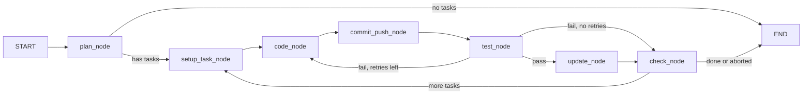

# Project Outline — CodeAgents-Open

> North Star document. Defines the vision, architecture, workflows, and decisions
> for the local, zero-cost AI agent system powering sprint automation on the data
> platform project.

---

## 1. Vision & Goals

Automate 80-90% of repetitive sprint work — from Notion pull to code gen,
testing, git/PRs, and doc updates — using a fully local, offline-capable
multi-agent system operated by a solo developer.

### Success Criteria

- **Offline-first**: Zero API costs. All inference runs locally via Ollama on
  consumer hardware (ThinkPad P16, 8GB+ VRAM).
- **Sprint-scoped**: One command kicks off a full sprint cycle — plan, spec,
  code, test, merge, update.
- **Grounded**: RAG from local Notion mirror eliminates hallucinations and
  context drift.
- **Safe**: Reflection gates and iteration caps kill rabbit holes. Human
  approval gates before destructive actions (PRs, merges, Notion writes).
- **Modular**: Swap models, add agents, plug tools — without rewriting core
  infrastructure.
- **Auditable**: Local Notion copy is maintained per-sprint, diffed against
  cloud before sync. All agent actions logged.
- **Testable**: Every agent has automated evaluations. Dry-run mode available
  for trust-building.
- **Endgame**: "Set it and forget it" for daily tasks, freeing developer time
  for design and review.

### Non-Goals (Phase 1-3)

- Cloud deployment or multi-user access.
- Real-time collaboration with other developers' agents.
- Production CI/CD integration (Phase 6).

---

## 2. Developer Context

This is a **solo developer** project. There is no team handoff — one person
plans, reviews, and approves. The agent system acts as a force multiplier, not
a replacement.

### Data Platform Tech Stack

The target codebase that agents will operate on includes:

| Layer              | Technology                          |
|--------------------|-------------------------------------|
| Infrastructure     | Bicep (Azure IaC)                   |
| Data Pipelines     | Azure Data Factory (ADF)            |
| Storage            | Medallion architecture (Parquet)    |
| Data Marts         | Azure SQL                           |
| Reporting          | Power BI                            |
| Backend/Scripts    | Python                              |
| Frontend           | React                               |

Agents must understand and produce code across all of these — this drives
model selection (coding-oriented models) and RAG strategy (repo + docs).

---

## 3. Hardware & Environment

| Component       | Current                | Future                          |
|-----------------|------------------------|---------------------------------|
| Machine         | ThinkPad P16           | Same, or dedicated GPU rig      |
| GPU VRAM        | 8 GB                   | 16+ GB for larger models        |
| LLM Runtime     | Ollama                 | Ollama (or vLLM if needed)      |
| Default Model   | qwen2.5-coder:7b (Q4)  | DeepSeek-Coder-V2, GLM-5, etc. |
| Expected Speed  | ~20-40 tps (Q4 7B)    | Varies by model/quant           |
| Python          | 3.11+                  | 3.11+                           |
| OS              | Windows 11             | Windows / WSL2 / Linux          |

> **OPEN**: Should we target WSL2 for Docker-based workflows later, or stay
> native Windows? Docker-compose (Ollama + Chroma containers) is smoother on
> Linux.

---

## 4. Technology Stack

### Core

| Layer            | Technology                  | Role                                    |
|------------------|-----------------------------|-----------------------------------------|
| Orchestration    | LangGraph (StateGraph)      | Graph control flow, state, loops        |
| Agent Framework  | CrewAI or LangChain agents  | Role-based teams, delegation            |
| LLM             | Ollama + ChatOllama         | Local inference                         |
| RAG             | ChromaDB + nomic-embed-text | Vector store for Notion mirror          |
| Embeddings      | nomic-embed-text (via Ollama) | Document embedding for RAG            |
| Config          | Pydantic Settings           | Typed config with env-var overrides     |

### Tools (Phase 2–3)

| Tool             | Technology                  | Role                                    |
|------------------|-----------------------------|-----------------------------------------|
| Code Editing     | Aider CLI                   | Git-aware diffs, file edits             |
| IDE Integration  | Continue.dev                | VS Code sidecar for interactive edits   |
| Git/PRs          | az CLI + Python wrappers    | Branch, commit, PR creation via az CLI  |
| Notion Sync      | Notion API (official SDK)   | Read/write sprint DBs, pages, tasks     |
| Testing          | pytest + custom runners     | Unit tests, pipeline validation         |

### Infrastructure (Phase 5+)

| Component        | Technology                  | Role                                    |
|------------------|-----------------------------|-----------------------------------------|
| Containerization | Docker Compose              | Ollama, Chroma, agent services          |
| Logging          | structlog or Python logging | Structured, queryable agent traces      |
| Observability    | Custom local logger         | Token counts, latency, success rates    |

---

## 5. Architecture

### 5.1 Folder Structure (Current + Planned)

```
CodeAgents-Open/
├── agents/                 # Agent definitions
│   ├── base.py             # BaseAgent ABC
│   ├── sprint_planner.py   # Phase 1: Sprint planning
│   ├── coder.py            # Phase 3: Code generation
│   ├── tester.py           # Phase 3: Test runner
│   └── updater.py          # Phase 3: Notion/git updater
├── tools/                  # External tool wrappers
│   ├── notion_tool.py      # Phase 2: Notion API
│   ├── git_tool.py         # Phase 2: Azure DevOps git/PR (via az CLI)
│   ├── aider_tool.py       # Phase 5: Aider CLI wrapper
│   └── continue_tool.py    # Phase 5: Continue.dev bridge
├── rag/                    # RAG pipeline (Phase 4)
│   ├── ingest.py           # Notion → ChromaDB ingestion
│   ├── retriever.py        # Semantic search query interface
│   └── snapshot_lookup.py  # Relational snapshot index for composed queries
├── orchestration/          # Multi-agent flow (Phase 3)
│   ├── graph.py            # LangGraph StateGraph definition
│   ├── state.py            # Shared state schema (TypedDict)
│   └── runner.py           # CascadeRunner wrapper
├── config/
│   ├── settings.py         # Pydantic settings, registries
│   └── .env                # Local overrides (gitignored)
├── prompts/                # Prompt templates (Phase 2+)
│   ├── sprint_planner.md   # Versioned prompt for planner
│   └── coder.md            # Versioned prompt for coder
├── tests/                  # Test suite
│   ├── test_agents.py      # Agent unit tests
│   └── test_tools.py       # Tool integration tests
├── evals/                  # Agent evaluation harness (Phase 3)
│   ├── eval_runner.py      # Automated eval execution
│   └── datasets/           # Gold-standard inputs/outputs per agent
├── docs/                   # Documentation
│   ├── project-outline.md  # This file — north star
│   ├── architecture.md     # Technical architecture
│   ├── roadmap.md          # Phased delivery plan
│   ├── ollama-setup.md     # Ollama install guide
│   └── dev-planning/       # Deferred decisions & design docs
│       ├── failure-modes.md
│       └── prompt-management.md
├── main.py                 # CLI entry point
└── requirements.txt
```

### 5.2 Agent Registry & Tool Loader

Agents and tools use the same pattern: a registry dict mapping names to dotted
import paths, with dynamic import via `resolve_agent_class()` /
`resolve_tool_class()`. This allows adding new agents/tools without touching
core code.

### 5.3 Model Configuration

A **default model** is defined via env variable (`OLLAMA_MODEL`). Individual
agents can override the model and inference parameters (temperature, top-p,
etc.) to best suit their use case. The override is defined in the agent config,
not hardcoded.

```
# .env (system default)
OLLAMA_MODEL=qwen2.5-coder:7b
OLLAMA_TEMPERATURE=0.2

# Agent-level override example (in agent config or registry)
# sprint_planner → uses default
# coder → OLLAMA_MODEL_CODER=deepseek-coder-v2:16b
# updater → OLLAMA_MODEL_UPDATER=qwen2.5:3b (faster, simpler tasks)
```

### 5.4 Multi-Agent Cascade

The cascade is orchestrated by a LangGraph `StateGraph` — there is no supervisor
agent. Conditional routing functions handle flow control, retries, and abort logic.



**Iteration caps per agent:**

| Agent          | Max Iterations | Scope                                      |
|----------------|----------------|---------------------------------------------|
| SprintPlanner  | 2              | Near one-shot; retry once on JSON parse fail |
| CoderAgent     | 5 (inner)      | Aider code-fix cycles within `code_node`     |
| Orchestrator   | 2 (outer)      | Test failure → re-route to `code_node`       |
| TesterAgent    | 1              | Single test run; failures are data           |
| UpdaterAgent   | 2              | Retry once on transient PR/Notion failure    |

**Two reflection layers:**
- **Inner reflection**: CoderAgent retries Aider internally (up to 5 iterations)
  when code edits fail or produce errors.
- **Outer reflection**: After `test_node`, if tests fail and outer retries remain,
  the orchestrator routes back to `code_node` (up to 2 retries).

**`commit_push_node`** sits between `code_node` and `test_node` — it commits
Aider's file changes and pushes the task branch to the remote, unblocking PR
creation downstream.

**Fallback**: On max retries, the task is marked as failed and added to
`failed_task_ids`. If the failure ratio exceeds `abort_threshold`, the cascade
aborts.

### 5.5 State & Checkpointing

State is persisted, not ephemeral. The system uses **checkpoints** to allow
resuming and auditing.

#### Initial Implementation (Phase 3)

- One checkpoint per sprint **work item** (task).
- When a task completes (or fails), its state is saved to disk.
- A failed sprint can resume from the last successful task checkpoint.

#### Future Granularity

- Per-agent-node checkpoints (e.g., Planner done → checkpoint → Coder starts).
- Rollback capability: revert a task to a prior checkpoint and re-run.
- State diff viewer: compare checkpoints to see what changed.

#### State Schema

```python
class SprintState(TypedDict):
    sprint_id: str
    plan: dict                                          # Full SprintPlanner output
    tasks: list[dict]                                   # Individual task dicts from plan
    current_task_index: int                             # Index into tasks list
    task_results: dict[str, dict]                       # task_id → per-agent results
    errors: Annotated[list[str], operator.add]           # Accumulated errors (reducer)
    iteration_counts: dict[str, int]                    # "agent:task_id" → retry count
    status: str                                         # running | completed | aborted | escalated
    failed_task_ids: Annotated[list[str], operator.add]  # Skipped task IDs (reducer)
    abort_threshold: float                              # Max failure ratio (default 0.5)
    max_tasks: int                                      # Limit tasks processed (0 = all)
```

> `errors` and `failed_task_ids` use LangGraph **reducer fields** — they
> accumulate across nodes via `operator.add` rather than being overwritten.

---

## 6. Core Workflows

### 6.1 Sprint Cycle (End-to-End)

This is the solo developer workflow — agents execute, human reviews and
approves at defined gates.

```
┌─────────────────────────────────────────────────────────────────┐
│                    SPRINT LIFECYCLE                              │
│                                                                 │
│  1. PLAN (Human)                                                │
│     └─ Plan sprint & write specs in Notion (cloud)              │
│                                                                 │
│  2. SYNC DOWN                                                   │
│     └─ Download Notion DBs → local vector DB / local copy       │
│                                                                 │
│  3. AGENT EXECUTION                                             │
│     └─ Agents carry out sprint tasks:                           │
│        - Planner → Coder → Tester → Updater                    │
│        - Updates go to LOCAL Notion copy only                   │
│        - On conflict → human intervention                       │
│                                                                 │
│  4. AUDIT                                                       │
│     └─ Diff local Notion copy against original cloud version    │
│        - Expected changes: status, notes, evidence → auto-pass  │
│        - Unexpected changes → flag for human review             │
│        - Cross-reference against codebase & logs                │
│                                                                 │
│  5. REVIEW & RESOLVE                                            │
│     └─ Human reviews discrepancies, approves or rejects         │
│                                                                 │
│  6. SYNC UP                                                     │
│     └─ Push approved Notion updates to cloud                    │
│                                                                 │
│  7. REPEAT                                                      │
│     └─ If spec changes impact current sprint:                   │
│        - Add fix-up tasks → re-run agents → re-audit            │
└─────────────────────────────────────────────────────────────────┘
```

### 6.2 Per-Task Execution Flow

Within the agent execution phase, each work item follows:

1. Agent picks up task from the sprint plan.
2. Coder generates code on a **fresh branch derived from main**.
3. Tester runs tests **on that task's branch**.
4. If tests pass → PR is created targeting the **sprint branch**.
5. PR is auto-reviewed by agents, then merged to sprint branch. *(Not yet implemented — UpdaterAgent creates PRs but auto-review/merge is a future goal.)*
6. Checkpoint saved for the task.
7. If tests fail → Coder retries with error context (max 5 inner / 2 outer). On max → escalate.

### 6.3 RAG Context Pipeline

```
Notion (cloud) → sync → JSON snapshots + content/*.md
                              │
                              ▼
                  ┌──────────────────────┐
                  │  Ingest              │
                  │  Chunk + embed       │──▶ ChromaDB (nomic-embed-text)
                  │  (nomic-embed-text)  │
                  └──────────────────────┘

Agents query at runtime via dual-context pattern:

┌──────────────────┐     ┌───────────────────┐
│  RAGRetriever    │     │  SnapshotLookup   │
│  (semantic)      │     │  (relational)     │
│  ChromaDB query  │     │  JSON index O(1)  │
└────────┬─────────┘     └────────┬──────────┘
         │                        │
         │   ┌────────────────────┘
         │   │  Composed queries:
         │   │  snapshot IDs → RAG filter
         ▼   ▼
   ┌─────────────────┐
   │  Agent prompt   │
   │  (context)      │
   └─────────────────┘
```

> **DEFERRED**: Delta sync strategy deferred to Phase 5+. Current implementation
> uses bulk re-ingest via `python main.py ingest` (with `--force` for full rebuild).
> Timestamp-based polling remains the most practical approach when implemented,
> given Notion doesn't support native webhooks.

### 6.4 Git Branching Strategy

```
main
  │
  ├── sprint-8/                     ← Sprint branch (created at sprint start)
  │     ├── sprint-8/SP8-001       ← Task branch (fresh from main)
  │     ├── sprint-8/SP8-002       ← Task branch (fresh from main)
  │     └── sprint-8/SP8-003       ← Task branch (fresh from main)
  │           │
  │           └── PR → sprint-8/    ← Auto-reviewed, merged to sprint branch
  │
  └── (sprint-8/ merges to main after full sprint review)
```

- Each task gets a **fresh branch from main** (not from sprint branch) to avoid
  compounding issues.
- Task PRs target the sprint branch.
- Sprint branch merges to main only after full review.
- Branch naming convention and PR templates: defined with prompt management
  (see `docs/dev-planning/prompt-management.md`).

---

## 7. Azure DevOps Integration

### Authentication

- **az CLI** for authentication and interaction with Azure DevOps.
- Connection details (org URL, project, repo) stored as **env variables**.
- No PAT management needed — az CLI handles auth via device code or cached
  credentials.

```
# .env
AZURE_DEVOPS_ORG=https://dev.azure.com/your-org
AZURE_DEVOPS_PROJECT=your-project
AZURE_DEVOPS_REPO=your-repo
```

### Git Workflow

1. Agent clones/pulls latest `main`.
2. Creates sprint branch: `sprint-{N}`.
3. Per task: creates feature branch from main: `task/sprint-{N}/{task-id}`.
4. Aider makes edits, agent commits with structured messages.
5. Tests run on the task branch.
6. Agent creates PR targeting sprint branch via `az repos pr create`.
7. Auto-review by agent, then merge to sprint branch. *(Future goal — not yet implemented.)*
8. Sprint branch → main only after full human review.

### Human Approval Gates

The following actions **always** require human confirmation:

- Git merges to `main`
- Notion sync to cloud
- Conflict intervention (local Notion vs cloud)
- Live `az` command runs (excluding canned/templated commands like
  `az repos pr list`)

---

## 8. Notion Integration

### Databases to Sync

Five Notion databases are synced (resolved in Phase 2a; IDs configured in `config/settings.py`):

- **Work Items** (`notion_work_items_db`) — tasks, story points, status, assignee, deps
- **Phases & Sprints** (`notion_sprints_db`) — sprint metadata and timelines
- **Docs & Specs** (`notion_docs_db`) — technical documentation
- **Decisions / ADRs** (`notion_decisions_db`) — architecture decision records
- **Risks & Issues** (`notion_risks_db`) — tracked risks and open issues

### Sync Strategy — Local-First with Audit

Notion is **not** written to in real-time during agent execution. Instead:

1. **Sprint start**: Full pull from cloud Notion → local copy + ChromaDB.
2. **During sprint**: Agents read from and write to the **local copy only**.
3. **Sprint end**: Diff local copy against cloud original.
   - Expected changes (status, notes, evidence) → auto-approve.
   - Unexpected changes → flag for human review.
4. **After review**: Push approved updates to cloud Notion.

### Conflict Handling

If cloud Notion was updated during the sprint (e.g., spec change):
- Agent pauses, flags the conflict.
- Human reviews the change.
- If spec change impacts current sprint: new fix-up tasks are created, agents
  re-run on those tasks, and the audit cycle repeats.

---

## 9. Model Strategy

### Default + Per-Agent Overrides

A system-wide default model is set via env variable. Individual agents can
override the model to match their task profile.

| Agent          | Priority Trait     | Candidate Models              |
|----------------|--------------------|-------------------------------|
| Sprint Planner | Reasoning, JSON    | qwen2.5-coder:7b (default)    |
| Coder          | Code generation    | deepseek-coder-v2, qwen2.5   |
| Tester         | Code understanding | Same as Coder                 |
| Updater        | Instruction follow | Smaller/faster model (3B?)    |

Override via env vars:

```
OLLAMA_MODEL=qwen2.5-coder:7b          # System default
OLLAMA_MODEL_CODER=deepseek-coder-v2   # Coder-specific override
OLLAMA_MODEL_UPDATER=qwen2.5:3b        # Updater-specific override
```

---

## 10. Testing & Dry-Run Mode

### Automated Agent Evaluations

Every agent will have automated evaluations before being used in live sprints.
Eval harness lives in `evals/` with gold-standard input/output datasets per
agent.

> Evaluation criteria and datasets will be fully scoped before Phase 2 Notion
> integration begins.

### Dry-Run Mode

A `--dry-run` flag that shows all planned actions without executing them:

- No git operations (no branches, commits, PRs)
- No Notion writes (neither local copy nor cloud)
- Console output shows what *would* happen
- Useful for building trust and debugging agent behavior

### Per-Task Testing

Tests are run for each task **before** it gets merged into parent branches.
A task cannot PR to the sprint branch until its tests pass.

---

## 11. Safety & Guardrails

### Reflection Gates

Each agent node in the LangGraph has a reflection step:
- **Self-critique**: "Does my output match the input spec?"
- **Relevance check**: "Am I answering the right question?"
- **Iteration cap**: Hard limit (default 3) per node. Exceeding → escalate.

### Human-in-the-Loop Gates

Mandatory approval before:
- Git merges to `main`
- Notion sync to cloud
- Conflict intervention
- Live `az` commands (non-templated)

### Sandboxing

- Code generation operates on task branches, never `main` directly.
- Notion writes go to local copy only during sprint execution.
- File edits are diffed and logged before commit.
- Sprint branch is the "staging" area between task work and main.

---

## 12. Phased Delivery

| Phase | Focus                              | Status      |
|-------|------------------------------------|-------------|
| 1     | Foundation                         | Complete    |
| 2a    | Notion Read-Only Sync              | Complete    |
| 2b    | Git Tool                           | Complete    |
| 2c    | Notion Write Tool                  | Complete    |
| 2d    | Wire Tools into Agents             | Complete    |
| 2e    | Page Content Sync                  | Complete    |
| 2.5   | Agent Quality Pass                 | Complete    |
| 2.6a  | Doc Cleanup & Dependency Updates   | Complete    |
| 2.6b  | Model Benchmarking                 | Complete    |
| 3a    | Structured Error Return              | Complete    |
| 3b    | SprintState Schema                   | Complete    |
| 3c    | Aider Tool                           | Complete    |
| 3d    | CoderAgent                           | Complete    |
| 3e    | TesterAgent + UpdaterAgent           | Complete    |
| 3f    | LangGraph Cascade                    | Complete    |
| 3g    | CLI Integration + Docs               | Complete    |
| 3.5   | Live Validation & Fixes              | Complete    |
| 4     | RAG & Context                      | Complete    |
| 4c.5  | Parser Fixes & Live Validation     | Complete    |
| 5     | IDE & Review Tools                 | Not started |
| 6     | Production Hardening               | Not started |

See [roadmap.md](roadmap.md) for detailed phase breakdowns.

---

## 13. Deferred Decisions

These topics need further thought and are tracked in `dev-planning/`:

| Topic              | File                                               | Notes                                    |
|--------------------|----------------------------------------------------|------------------------------------------|
| Failure Modes      | [failure-modes.md](dev-planning/failure-modes.md)  | How agents handle and recover from errors |
| Prompt Management  | [prompt-management.md](dev-planning/prompt-management.md) | Versioning, templates, A/B testing  |

---

## 14. Open Questions Summary

| #  | Question                                                                 | Phase | Priority | Status   |
|----|--------------------------------------------------------------------------|-------|----------|----------|
| 1  | WSL2/Docker vs native Windows for container workflows?                   | 5+    | Low      | Open     |
| 2  | Delta sync from Notion — polling interval?                               | 5+    | Medium   | Deferred |
| 3  | Prompt versioning beyond git — eval harness?                             | 2     | Medium   | Deferred |
| 4  | Which Notion databases are in scope (IDs, schemas)?                      | 2     | High     | Resolved |
| 5  | Git tool must support both Azure DevOps (az repos) and GitHub (gh CLI) — abstraction layer needed? | 2b | High | Resolved |

**#4 Resolved** — 5 databases synced in Phase 2a: Work Items, Phases & Sprints,
Docs & Specs, Decisions (ADRs), Risks & Issues. DB IDs configured in
`config/settings.py`, schemas in `schemas/notion_models.py`.

**#5 Resolved** — BaseGitTool ABC with GitHubTool and AzDevOpsTool providers.
Implemented in Phase 2b.

Items resolved from prior version:
- ~~State persistence~~ → Checkpoints per work item, expanding to per-node.
- ~~Agent evaluations~~ → Automated evals for every agent, scoped before Phase 2.
- ~~Failure modes~~ → Deferred to `dev-planning/failure-modes.md`.
- ~~Prompt management~~ → Deferred to `dev-planning/prompt-management.md`.
- ~~Solo vs team workflow~~ → Solo developer, local-first Notion sync with audit.
- ~~Azure DevOps auth~~ → az CLI with env vars for connection details.
- ~~Dry-run mode~~ → Yes, `--dry-run` flag planned.
- ~~Per-agent model selection~~ → Default model + per-agent env var overrides.
- ~~Data platform tech stack~~ → Bicep, ADF, Parquet, Azure SQL, Power BI, Python, React.
- ~~Human approval gates~~ → Git merges to main, Notion cloud sync, conflicts, live az commands.

---

## 15. Risks & Mitigations

| Risk                                      | Mitigation                                        |
|-------------------------------------------|---------------------------------------------------|
| 7B models produce low-quality code        | Reflection gates + human review. Upgrade models.  |
| RAG retrieves irrelevant context          | Tune chunk size, embedding model, top-k.          |
| Agents loop endlessly                     | Hard iteration caps per node. LangGraph abort threshold. |
| Notion API rate limits                    | Batch writes, cache reads, respect rate headers.  |
| Task branch diverges from main            | Fresh branch from main per task, not from sprint.  |
| VRAM exhaustion with larger models        | Stick to Q4 quant. Monitor with `nvidia-smi`.     |
| Prompt drift as project evolves           | Version prompts in git. Periodic eval runs.       |
| Local Notion copy conflicts with cloud    | Audit diff + human review before sync-up.         |
